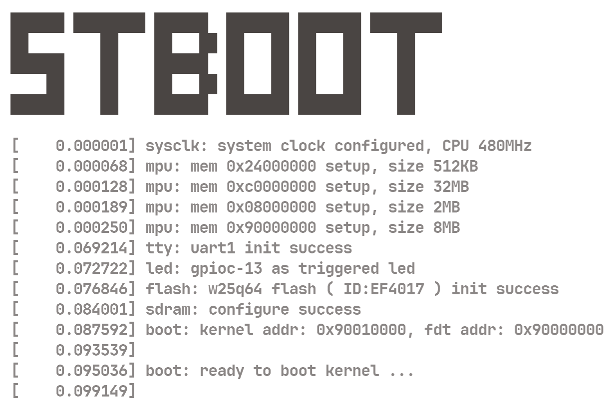

<p align="center">
  <a>
    
  </a>
</p>


> stm32 bootloader for linux, base on HAL library, easy for you to customize functions
- 当前支持的硬件设备

  - **STM32H7**-FK（反客科技）
    - `MCU`   *STM32H743*   *STM32H750*
    
    - `SDRAM`   *W9825G6KH-6I*
    - `QSPI-Flash`   *W25Q64*


- 编译平台

  - **WSL2：Ubuntu24.04**

    > Ubuntu 中使用 *arm-none-eabi-gcc* 交叉编译 kernel 和 buildroot
    >
    > 请使用 *arm-none-eabi-gcc-10.3.1* 及以上版本，否则内核有可能无法识别 Cortex-M7 的 cpuid
    
  - **Windows 11**（可选）

    > 编译 stboot
    >
    > 注意修改 cmake 路径 与 mcu 型号
    
    ```cmake
    5:  set(TOOLCHAIN_PATH         B:/arm-gnu-toolchain ) #! toolchain location
    ```
    
    ```cmake
    44: add_definitions(-DUSE_HAL_DRIVER -DSTM32H743xx) #! H743
    ```


- 启动行为
  - 配置  Cache 对于 内存 和 Flash 的读写策略：`mpu_config`
  - 系统时钟设定为 480 MHz：`sysclk_config`
  - 启用串口 1 作为输出： `uart1_tty_init`
  - 配置 QSPI-Flash 并开启 XIP 模式：`QSPI_W25Qxx_Init` `QSPI_W25Qxx_MMMode`
  - 启用 SDRAM：`sdram_init`
  - 关闭 DCache 与中断，跳转到内核：`kernel_entry`


- 简单配置
  - `EPB_BUF_SIZE`：early print 缓冲区大小（default to 512B ）
  - `USE_SRAM_D2` `USE_SRAM_D3`：是否使用 288KB + 64KB 的 D2 D3 域 SRAM
  - `FDT_ADDR` `FDT_SIZE`：设备树基地址 和 容量大小（default 64KB，a Flash Block）
  - `KERNEL_ADDR`：内核基地址 = `FDT_ADDR` + `FDT_SIZE`
  - `UART_Baudrate`：串口波特率（default **115200** bps）
  - `LED_BLINK_TIME`：stboot 启动闪烁间隔（default **50ms**）


- config

  - **ST-Boot**：已编译完成的 `stboot.bin` 烧录到 `0x0800_0000`

  - **FDT**：将 `stm32h743i-disco.dtb.bin` 烧录到 `0x9000_0000`
  
    
  
  - **内核与文件系统**
  
    > User Name：`root`
    >
    > Passwd：`0`
  
    - 【方式一】`xipImage.bin` 是已经和 `rootfs.cpio.gz` 编译为一体的内核镜像，烧录到 `0x9001_0000`
  
      > 采用 initramfs 方式，文件系统存在于 ram，操作也不具有记忆性断电后消失
  
    - 【方式二】采用 sdmmc，将编译好的文件系统 `config/buildroot/rootfs_mmc.tar.gz` 解压并写入 tf 卡
  
      > 文件系统存在于 sdmmc，具备持久性
  
    
  
  - 烧录完成并复位后，stboot 与内核的启动信息如下
  
    ```shell
    ██████ ████████ ██████  ███████ ███████ ████████
    ██        ██    ██   ██ ██   ██ ██   ██    ██   
    ██████    ██    ██████  ██   ██ ██   ██    ██   
        ██    ██    ██   ██ ██   ██ ██   ██    ██   
    ██████    ██    ██████  ███████ ███████    ██   
    
    [    0.045271] mpu: mem 0x24000000 setup, size 512KB
    [    0.050001] mpu: mem 0xc0000000 setup, size 32MB
    [    0.054637] mpu: mem 0x08000000 setup, size 2MB
    [    0.059187] mpu: mem 0x90000000 setup, size 8MB
    [    0.063735] sysclk: system clock configured, CPU 480MHz
    [    0.068980] tty: uart1 init success
    [    0.072484] led: gpioc-13 as triggered led
    [    0.076606] flash: w25q64 flash ( ID:EF4017 ) init success
    [    0.084001] sdram: configure success
    [    0.087592] bootargs: kernel addr: 0x90010000, fdt addr: 0x90000000
    [    0.093888] 
    [    0.095385] boot: ready to boot kernel ...
    [    0.099498]
    [    0.000000] Booting Linux on physical CPU 0x0
    [    0.000000] Linux version 6.12.0 (boboo@Linux01) (arm-none-eabi-gcc (15:10.3-2021.07-4) 10.3.1 20210621 (release), GNU ld (2.38-3ubuntu1+15build1) 2.38) #3 Sun Nov 24 20:40:54 CST 2024
    [    0.000000] CPU: ARMv7-M [411fc271] revision 1 (ARMv7M), cr=00000000
    [    0.000000] CPU: PIPT / VIPT nonaliasing data cache, PIPT instruction cache
    [    0.000000] OF: fdt: Machine model: STMicroelectronics STM32H743i-FK (反客科技)
    [    0.000000] printk: legacy bootconsole [earlycon0] enabled
    [    0.000000] printk: debug: ignoring loglevel setting.
    [    0.000000] Zone ranges:
    [    0.000000]   Normal   [mem 0x00000000c0000000-0x00000000c1ffffff]
    [    0.000000] Movable zone start for each node
    [    0.000000] Early memory node ranges
    [    0.000000]   node   0: [mem 0x00000000c0000000-0x00000000c1ffffff]
    [    0.000000] Initmem setup node 0 [mem 0x00000000c0000000-0x00000000c1ffffff]
    [    0.000000] pcpu-alloc: s0 r0 d32768 u32768 alloc=1*32768
    [    0.000000] pcpu-alloc: [0] 0 
    [    0.000000] Kernel command line: console=ttySTM0,115200n8 earlyprintk ignore_loglevel root=/dev/mmcblk0 rw rootwait
    [    0.000000] Dentry cache hash table entries: 4096 (order: 2, 16384 bytes, linear)
    [    0.000000] Inode-cache hash table entries: 2048 (order: 1, 8192 bytes, linear)
    [    0.000000] Built 1 zonelists, mobility grouping on.  Total pages: 8192
    [    0.000000] allocated 32768 bytes of page_ext
    [    0.000000] mem auto-init: stack:off, heap alloc:off, heap free:off
    [    0.000000] SLUB: HWalign=32, Order=0-1, MinObjects=0, CPUs=1, Nodes=1
    [    0.000000] Invalid parameters for execmem allocator, module loading will fail
    [    0.000000] NR_IRQS: 16, nr_irqs: 16, preallocated irqs: 16
    [    0.000000] /soc/interrupt-controller@58000000: bank0
    [    0.000000] /soc/interrupt-controller@58000000: bank1
    [    0.000000] /soc/interrupt-controller@58000000: bank2
    [    0.000000] clocksource: arm_system_timer: mask: 0xffffff max_cycles: 0xffffff, max_idle_ns: 29863442 ns
    [    0.000000] ARM System timer initialized as clocksource
    [    0.000088] sched_clock: 32 bits at 120MHz, resolution 8ns, wraps every 17895697403ns
    [    0.016276] timer@40000c00: STM32 sched_clock registered
    [    0.027135] Switching to timer-based delay loop, resolution 8ns
    [    0.039145] timer@40000c00: STM32 delay timer registered
    [    0.050010] clocksource: timer@40000c00: mask: 0xffffffff max_cycles: 0xffffffff, max_idle_ns: 15927170388 ns
    [    0.070274] /soc/timer@40000c00: STM32 clockevent driver initialized (32 bits)
    [    0.088137] Calibrating delay loop (skipped), value calculated using timer frequency.. 240.00 BogoMIPS (lpj=1200000)
    [    0.110137] pid_max: default: 4096 minimum: 301
    [    0.120543] Mount-cache hash table entries: 1024 (order: 0, 4096 bytes, linear)
    [    0.136092] Mountpoint-cache hash table entries: 1024 (order: 0, 4096 bytes, linear)
    [    0.189070] Memory: 31564K/32768K available (2273K kernel code, 337K rwdata, 1100K rodata, 76K init, 110K bss, 904K reserved, 0K cma-reserved)
    [    0.223762] devtmpfs: initialized
    [    0.285465] clocksource: jiffies: mask: 0xffffffff max_cycles: 0xffffffff, max_idle_ns: 19112604462750000 ns
    [    0.306914] pinctrl core: initialized pinctrl subsystem
    [    0.344734] cpuidle: using governor menu
    [    0.445956] stm32h743-pinctrl soc:pinctrl@58020000: GPIOA bank added
    [    0.467191] stm32h743-pinctrl soc:pinctrl@58020000: GPIOB bank added
    [    0.488693] stm32h743-pinctrl soc:pinctrl@58020000: GPIOC bank added
    [    0.509742] stm32h743-pinctrl soc:pinctrl@58020000: GPIOD bank added
    [    0.531267] stm32h743-pinctrl soc:pinctrl@58020000: GPIOE bank added
    [    0.553037] stm32h743-pinctrl soc:pinctrl@58020000: GPIOF bank added
    [    0.575071] stm32h743-pinctrl soc:pinctrl@58020000: GPIOG bank added
    [    0.596886] stm32h743-pinctrl soc:pinctrl@58020000: GPIOH bank added
    [    0.618994] stm32h743-pinctrl soc:pinctrl@58020000: GPIOI bank added
    [    0.641154] stm32h743-pinctrl soc:pinctrl@58020000: GPIOJ bank added
    [    0.662691] stm32h743-pinctrl soc:pinctrl@58020000: GPIOK bank added
    [    0.676777] stm32h743-pinctrl soc:pinctrl@58020000: Pinctrl STM32 initialized
    [    0.751159] stm32-mdma 52000000.dma-controller: STM32 MDMA driver registered
    [    0.790488] clocksource: Switched to clocksource timer@40000c00
    [    0.855956] workingset: timestamp_bits=30 max_order=13 bucket_order=0
    [    0.875491] io scheduler mq-deadline registered
    [    0.885798] io scheduler kyber registered
    [    0.894981] io scheduler bfq registered
    [    0.942800] STM32 USART driver initialized
    [    0.958934] stm32-usart 40011000.serial: interrupt mode for rx (no dma)
    [    0.973415] stm32-usart 40011000.serial: interrupt mode for tx (no dma)
    [    0.993813] 40011000.serial: ttySTM0 at MMIO 0x40011000 (irq = 31, base_baud = 7500000) is a stm32-usart
    [    1.014549] printk: legacy console [ttySTM0] enabled
    [    1.014549] printk: legacy console [ttySTM0] enabled
    [    1.035169] printk: legacy bootconsole [earlycon0] disabled
    [    1.035169] printk: legacy bootconsole [earlycon0] disabled
    [    1.009824] brd: module loaded
    [    2.092657] mmci-pl18x 52007000.mmc: mmc0: PL180 manf 53 rev1 at 0x52007000 irq 32,0 (pio)
    [    2.112770] clk: Disabling unused clocks
    [    2.139517] Waiting for root device /dev/mmcblk0...
    [    2.209532] mmc0: host does not support reading read-only switch, assuming write-enable
    [    2.232840] mmc0: new high speed SDHC card at address 5048
    [    2.251283] mmcblk0: mmc0:5048 SD32G 29.7 GiB
    [    2.581663] EXT4-fs (mmcblk0): recovery complete
    [    2.597196] EXT4-fs (mmcblk0): mounted filesystem 30a9e076-6442-45c9-aea0-64ae2845ef0e r/w with ordered data mode. Quota mode: disabled.
    [    2.621062] VFS: Mounted root (ext4 filesystem) on device 179:0.
    [    2.643332] devtmpfs: mounted
    [    2.648635] Freeing unused kernel image (initmem) memory: 12K
    [    2.658769] This architecture does not have kernel memory protection.
    [    2.671686] Run /sbin/init as init process
    [    2.679677]   with arguments:
    [    2.685179]     /sbin/init
    [    2.690884]   with environment:
    [    2.697403]     HOME=/
    [    2.701498]     TERM=linux
    [    2.958995] EXT4-fs (mmcblk0): re-mounted 30a9e076-6442-45c9-aea0-64ae2845ef0e r/w. Quota mode: disabled.
    Seeding 256 bits without crediting
    Saving 256 bits of non-creditable seed for next boot
    Starting mdev... OK
    modprobe: can't change directory to '6.11.0-g29002a45fd6e-dirty': No such file or directory
    
    Welcome to Buildroot
    user login: root
    Password: 
    Jan  1 00:00:19 login [47]: root login on 'console'
    ~ # uname -a
    Linux boboo 6.11.0-g29002a45fd6e #47 Mon Nov 18 12:53:12 CST 2024 armv7ml GNU/Linux
    ~ # cat /proc/meminfo 
    MemTotal:          32012 kB
    MemFree:           23908 kB
    ... ...
    Percpu:               32 kB
    ~ # iostat 
    Linux 6.11.0-g29002a45fd6e (boboo)      01/01/70        _armv7ml_       (1 CPU)
    
    avg-cpu:  %user   %nice %system %iowait  %steal   %idle
               1.25    0.00   11.01    0.26    0.00   87.48
    
    Device:            tps   Blk_read/s   Blk_wrtn/s   Blk_read   Blk_wrtn
    mmcblk0           4.28        35.58        13.71       1910        736
    
    ~ # 
    ```
    
    