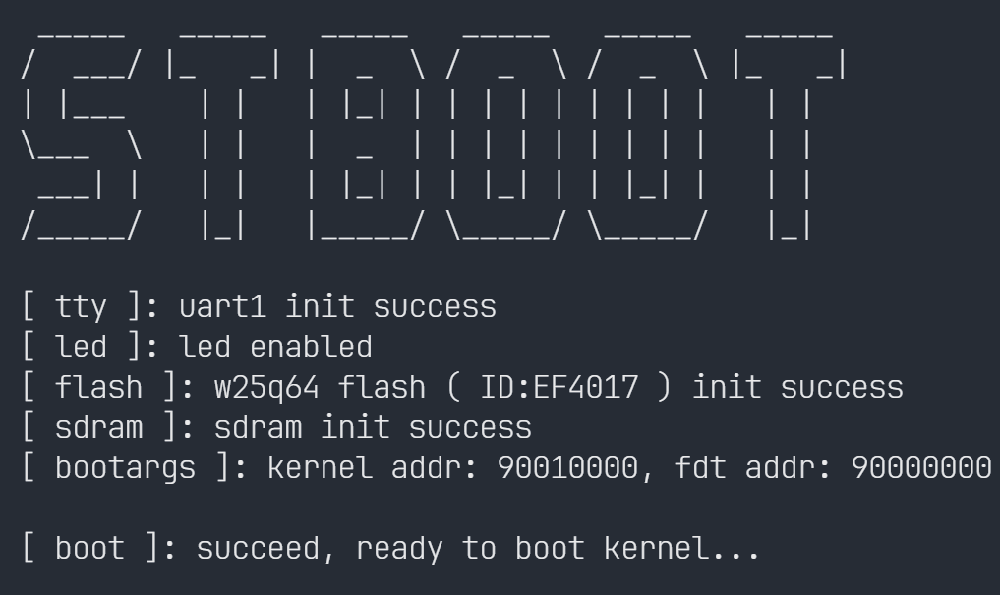

<p align="center">
  <a>
    
  </a>
</p>

<h1 align="center"> STBoot </h1>

> stm32 easy bootloader for linux, base on hal-library
- 支持的硬件设备

  - **STM32H7**-FK（反客科技）

    - `MCU`   *STM32H743*   *STM32H750*

    - `SDRAM`   *W9825G6KH-6I*
    - `QSPI-Flash`   *W25Q64*


- 编译平台

  - **WSL2：Ubuntu24.04**

    > Ubuntu 中使用 *arm-none-eabi-gcc* 交叉编译 kernel 和 buildroot
    >
    > 请使用 *arm-none-eabi-gcc-11* 及以上版本，否则内核有可能无法识别 Cortex-M7 的 cpuid
    
  - **Windows 11**

    > 编译 stboot
    >
    > 注意修改 cmake 路径 与 mcu 型号
    
    ```cmake
    5:  set(TOOLCHAIN_PATH         B:/arm-gnu-toolchain ) #! toolchain location
    ```
    
    ```cmake
    44: add_definitions(-DUSE_HAL_DRIVER -DSTM32H743xx) #! H743
    ```


- 启动行为
  - 配置  Cache 对于 内存 和 Flash 的读写策略：`mpu_config`
  - 系统时钟设定为 480 MHz：`sysclk_config`
  - 启用串口 1 作为输出： `uart1_tty_init`
  - 配置 QSPI-Flash 并开启 XIP 模式：`QSPI_W25Qxx_Init` `QSPI_W25Qxx_MMMode`
  - 启用 SDRAM：`sdram_init`
  - 跳转到内核：`kernel_entry`


- 简单配置
  - `FDT_ADDR` `FDT_SIZE`：设备树基地址 和 容量大小（默认为 64KB，a Flash Block）
  - `KERNEL_ADDR`：内核基地址 = `FDT_ADDR` + `FDT_SIZE`
  - `UART_Baudrate`：串口波特率
  - `LED_BLINK_TIMES`：stboot 启动闪烁次数


- out

  - 已编译完成的 `stboot.bin` 烧录到 `0x0800_0000`

  - 将 `stm32h743i-disco.dtb.bin` 烧录到 `0x9000_0000`
  
  - `xipImage.bin` 是已经和 `rootfs.cpio.gz` 编译为一体的内核镜像，烧录到 `0x9001_0000`
  
    - 根文件系统
  
      > 提供 `rootfs.cpio.gz`，和内核编译入内核文件后一同烧录到 **QSPI Flash**
  
      - User Name：`root`
      - Passwd：`0`
  
  - 烧录完成并复位后，stboot 与内核的启动信息如下
  
    ```shell
     _____   _____   _____   _____   _____   _____    
    /  ___/ |_   _| |  _  \ /  _  \ /  _  \ |_   _|
    | |___    | |   | |_| | | | | | | | | |   | |     
    \___  \   | |   |  _  | | | | | | | | |   | |   
     ___| |   | |   | |_| | | |_| | | |_| |   | |     
    /_____/   |_|   |_____/ \_____/ \_____/   |_|   
    
    [ tty ]: uart1 init success 
    [ led ]: led enabled 
    [ flash ]: w25q64 flash ( ID:EF4017 ) init success
    [ sdram ]: sdram init success 
    [ bootargs ]: kernel addr: 90010000, fdt addr: 90000000
    
    [ boot ]: succeed, ready to boot kernel... 
    
    [    0.000000] Booting Linux on physical CPU 0x0
    [    0.000000] Linux version 6.11.0 (boboo@Linux01) (arm-none-eabi-gcc (15:13.2.rel1-2) 13.2.1 20231009, GNU ld (2.42-1ubuntu1+23) 2.42) #6 Sat Nov 16 04:54:01 CST 2024
    [    0.000000] CPU: ARMv7-M [411fc271] revision 1 (ARMv7M), cr = 00000000
    [    0.000000] CPU: PIPT / VIPT nonaliasing data cache, PIPT instruction cache
    [    0.000000] OF: fdt: Machine model: STMicroelectronics STM32H743i-Discovery board
    [    0.000000] printk: legacy bootconsole [earlycon0] enabled
    [    0.000000] printk: debug: ignoring loglevel setting.
    [    0.000000] Zone ranges:
    [    0.000000]   Normal   [mem 0x00000000c0000000-0x00000000c1ffffff]
    [    0.000000] Movable zone start for each node
    [    0.000000] Early memory node ranges
    [    0.000000]   node   0: [mem 0x00000000c0000000-0x00000000c1ffffff]
    [    0.000000] Initmem setup node 0 [mem 0x00000000c0000000-0x00000000c1ffffff]
    [    0.000000] pcpu-alloc: s0 r0 d32768 u32768 alloc = 1*32768
    [    0.000000] pcpu-alloc: [0] 0 
    [    0.000000] Kernel command line: console = ttySTM0,115200n8 earlyprintk ignore_loglevel
    [    0.000000] Dentry cache hash table entries: 4096 (order: 2, 16384 bytes, linear)
    [    0.000000] Inode-cache hash table entries: 2048 (order: 1, 8192 bytes, linear)
    [    0.000000] Built 1 zonelists, mobility grouping on.  Total pages: 8192
    [    0.000000] mem auto-init: stack: all(zero), heap alloc: off, heap free: off
    [    0.000000] SLUB: HWalign = 32, Order = 0-1, MinObjects = 0, CPUs = 1, Nodes = 1
    [    0.000000] NR_IRQS: 16, nr_irqs: 16, preallocated irqs: 16
    [    0.000000] /soc/interrupt-controller@58000000: bank0
    [    0.000000] /soc/interrupt-controller@58000000: bank1
    [    0.000000] /soc/interrupt-controller@58000000: bank2
    [    0.000000] clocksource: arm_system_timer: mask: 0xffffff max_cycles: 0xffffff, max_idle_ns: 29863442 ns
    [    0.000000] ARM System timer initialized as clocksource
    [    0.000062] sched_clock: 32 bits at 120MHz, resolution 8ns, wraps every 17895697403ns
    [    0.016216] timer@40000c00: STM32 sched_clock registered
    [    0.027044] Switching to timer-based delay loop, resolution 8ns
    [    0.039022] timer@40000c00: STM32 delay timer registered
    [    0.049822] clocksource: timer@40000c00: mask: 0xffffffff max_cycles: 0xffffffff, max_idle_ns: 15927170388 ns
    [    0.070017] /soc/timer@40000c00: STM32 clockevent driver initialized (32 bits)
    [   20.553610] Calibrating delay loop (skipped), value calculated using timer frequency.. 240.00 BogoMIPS (lpj = 1200000)
    [   20.575465] pid_max: default: 4096 minimum: 301
    [   20.585559] Mount-cache hash table entries: 1024 (order: 0, 4096 bytes, linear)
    [   20.600905] Mountpoint-cache hash table entries: 1024 (order: 0, 4096 bytes, linear)
    [   20.641633] Memory: 31720K/32768K available (1919K kernel code, 268K rwdata, 560K rodata, 71K init, 101K bss, 764K reserved, 0K cma-reserved)
    [   20.674799] devtmpfs: initialized
    [   20.733900] clocksource: jiffies: mask: 0xffffffff max_cycles: 0xffffffff, max_idle_ns: 19112604462750000 ns
    [   20.754923] pinctrl core: initialized pinctrl subsystem
    [   20.871746] stm32h743-pinctrl soc: pinctrl@58020000: GPIOA bank added
    [   20.891923] stm32h743-pinctrl soc: pinctrl@58020000: GPIOB bank added
    [   20.912386] stm32h743-pinctrl soc: pinctrl@58020000: GPIOC bank added
    [   20.933135] stm32h743-pinctrl soc: pinctrl@58020000: GPIOD bank added
    [   20.953605] stm32h743-pinctrl soc: pinctrl@58020000: GPIOE bank added
    [   20.974271] stm32h743-pinctrl soc: pinctrl@58020000: GPIOF bank added
    [   20.995221] stm32h743-pinctrl soc: pinctrl@58020000: GPIOG bank added
    [   21.016501] stm32h743-pinctrl soc: pinctrl@58020000: GPIOH bank added
    [   21.037436] stm32h743-pinctrl soc: pinctrl@58020000: GPIOI bank added
    [   21.059048] stm32h743-pinctrl soc: pinctrl@58020000: GPIOJ bank added
    [   21.079814] stm32h743-pinctrl soc: pinctrl@58020000: GPIOK bank added
    [   21.093605] stm32h743-pinctrl soc: pinctrl@58020000: Pinctrl STM32 initialized
    [   21.160046] stm32-mdma 52000000.dma-controller: STM32 MDMA driver registered
    [   21.193516] clocksource: Switched to clocksource timer@40000c00
    [   21.266384] workingset: timestamp_bits = 30 max_order = 13 bucket_order = 0
    [   21.282773] JFS: nTxBlock = 250, nTxLock = 2000
    [   21.340595] io scheduler mq-deadline registered
    [   21.350712] io scheduler kyber registered
    [   21.368425] STM32 USART driver initialized
    [   21.383297] stm32-usart 40011000.serial: interrupt mode for rx (no dma)
    [   21.397846] stm32-usart 40011000.serial: interrupt mode for tx (no dma)
    [   21.416991] 40011000.serial: ttySTM0 at MMIO 0x40011000 (irq = 31, base_baud = 7500000) is a stm32-usart
    [   21.437420] printk: legacy console [ttySTM0] enabled
    [   21.437420] printk: legacy console [ttySTM0] enabled
    [   21.457846] printk: legacy bootconsole [earlycon0] disabled
    [   21.457846] printk: legacy bootconsole [earlycon0] disabled
    [   21.566457] brd: module loaded
    [   21.627747] clk: Disabling unused clocks
    [   22.011347] Freeing unused kernel image (initmem) memory: 12K
    [   22.021190] This architecture does not have kernel memory protection.
    [   22.033831] Run /init as init process
    [   22.040499]   with arguments:
    [   22.046746]     /init
    [   22.050953]   with environment:
    [   22.057499]     HOME =/
    [   22.061920]     TERM = linux
    [   22.069534] Failed to execute /init (error -8)
    [   22.076632] Run /sbin/init as init process
    [   22.084590]   with arguments:
    [   22.090151]     /sbin/init
    [   22.095804]   with environment:
    [   22.101867]     HOME =/
    [   22.106778]     TERM = linux
    rcS: applet not found
    
    Welcome to Buildroot
    boboo login: root
    Password: 
    Jan  9 07:31:08 login [30]: root login on 'console'
    ~ # uname -a
    Linux boboo 6.11.0 #6 Sat Nov 16 04:54:01 CST 2024 armv7ml GNU/Linux
    ~ # cat /proc/cpuinfo 
    processor       : 0
    model name      : ARMv7-M rev 1 (v7ml)
    BogoMIPS        : 240.00
    Features        : half thumb fastmult edsp idivt 
    CPU implementer : 0x41
    CPU architecture: 7M
    CPU variant     : 0x1
    CPU part        : 0xc27
    CPU revision    : 1
    
    Hardware        : STM32 (Device Tree Support)
    Revision        : 0000
    Serial          : 0000000000000000
    ~ # cat /proc/meminfo 
    MemTotal:          32016 kB
    MemFree:           28132 kB
    ... ... 
    Percpu:               32 kB
    ~ # 
    ```
  
    