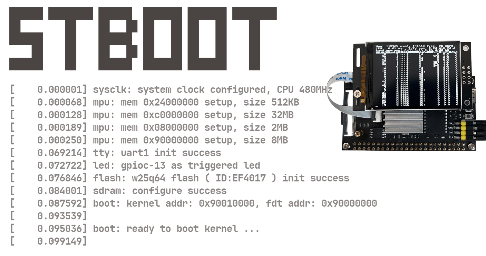

<p align="center">
  <a>
    
  </a>
</p>

> *stm32 bootloader for linux, base on hal library, easy for you to customize functions* 
- **Boards Support** 

  | Board                | MCU           | SDRAM        | QSPI-Flash | LCD                 |
  | -------------------- | ------------- | ------------ | ---------- | ------------------- |
  | FK743M5（Fank-Tech） | STM32H743XIH6 | W9825G6KH-6I | W25Q64     | ST7789V - 240 x 320 |
  |                      |               |              |            |                     |
  


- **Compile options configure** 

  ```cmake
  5:  set(TOOLCHAIN_PATH B:/arm-gnu-toolchain ) #! toolchain location
  ```

  ```cmake
  44: add_definitions(-DUSE_HAL_DRIVER -DSTM32H743xx) #! H743
  ```


- **Board Config** 
  
  - fcpu config：
  
    > **480MHz**（*BogoMIPS*  240）：`SYSCLK_PLL_N = 192`，`SYSCLK_PLL_M = 5`
    >
    > **550MHz**（*BogoMIPS*  275）：`SYSCLK_PLL_N = 88`，`SYSCLK_PLL_M = 2`
  
  - `EPB_BUF_SIZE`：size of buffer for early print （default to 512B）
  
  - `USE_SRAM_D2` `USE_SRAM_D3`：use SRAM in D2（288KB）and D3（64KB）
  
  - `FDT_ADDR` `FDT_SIZE`：the base address and size of fdt（default 64KB，a Flash Block）
  
  - `KERNEL_ADDR`：base address of kernel = `FDT_ADDR` + `FDT_SIZE`
  
  - `UART_Baudrate`：default **115200** bps
  
  - `CONSOLE_CMD`：whether use command console
  
  - `LED_BLINK_TIME`：the blink interval of LED（default **82ms**）
  
  
  
- **Shell** 
  
  <p align="left">
    <a>
      
    </a>
  </p>
  
  > add a new command
  
  ```c
  void help_newcmd(void) { ... }
  int do_newcmd(const char *buf) { ... }
  SHELL_EXPORT_CMD(newcmd, help_newcmd, do_newcmd);
  ```
  
  
  
- **Program** 

  【**UPDATE**】**支持 SD 卡烧写，将 设备树 / 内核镜像 重命名为 fdt / kernel，并拷贝到 SD 卡中，执行 `update fdt` 和 `update kernel` 即可完成烧录，烧录过程支持掉电恢复** 

  - `stboot.bin` -> `0x0800_0000`
  
  - `stm32h743i-disco.dtb.bin` -> `0x9000_0000`
  
  - `xipImage.bin` -> `0x9001_0000`
  
    > User Name:	**root**
    >
    > Passwd:		**0**
  
    ```shell
    ----------- _______________  ____  ____  ______  
       ------- / ___/_  __/ __ )/ __ \/ __ \/_  __/
          ---- \__ \ / / / __  / / / / / / / / /   
       ------ ___/ // / / /_/ / /_/ / /_/ / / /      
    -------- /____//_/ /_____/\____/\____/ /_/     
    
    ----------- _______________  ____  ____  ______  
       ------- / ___/_  __/ __ )/ __ \/ __ \/_  __/
          ---- \__ \ / / / __  / / / / / / / / /   
       ------ ___/ // / / /_/ / /_/ / /_/ / / /      
    -------- /____//_/ /_____/\____/\____/ /_/     
    
    [    0.000004] sysclk: system clock configured, CPU 480MHz
    [    0.000080] tcm: vectors -> 0x00001000, .itcm -> 0x00001298
    [    0.000144] mpu: mem 0x24000000 setup, size 512KB
    [    0.000203] mpu: mem 0xc0000000 setup, size 32MB
    [    0.000261] mpu: mem 0x08000000 setup, size 2MB
    [    0.000319] mpu: mem 0x90000000 setup, size 8MB
    [    0.051858] console: uart1 init success
    [    0.055372] led: gpioc-13 as triggered led
    [    0.059504] flash: w25q64 flash (ID:EF4017) init success
    [    0.066001] sdram: configure success
    [    0.083522] sdmmc: fatfs mounted
    [    0.086780] sdmmc: free: 29.5GB, total: 29.5GB
    => boot
    [    0.070592] boot: kernel addr: 0x90010000, fdt addr: 0x90000000
    [    0.076539] 
    [    0.078035] boot: ready to boot kernel ...
    [    0.082149]
    
    ... ...(kernel booting message)
    
    ~ # uname -a
    Linux user 6.12.0 #3 Sun Nov 24 20:40:54 CST 2024 armv7ml GNU/Linux
    ~ # cat /proc/meminfo 
    MemTotal:          32012 kB
    MemFree:           23908 kB
    ... ...
    Percpu:               32 kB
    ~ # iostat 
    Linux 6.12.0 (user)     01/01/70        _armv7ml_       (1 CPU)
    
    avg-cpu:  %user   %nice %system %iowait  %steal   %idle
               0.61    0.00    5.99    0.10    0.00   93.30
    
    Device:            tps   Blk_read/s   Blk_wrtn/s   Blk_read   Blk_wrtn
    mmcblk0           1.81        14.77         6.65       1758        792
    
    ~ # 
    ```