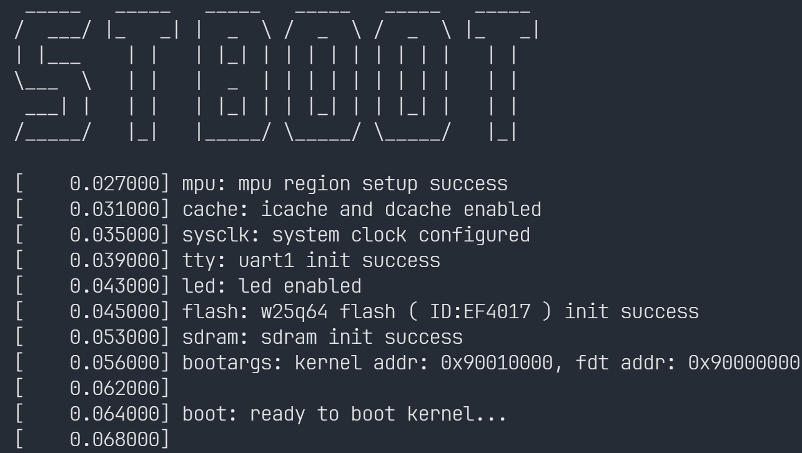

<p align="center">
  <a>
    
  </a>
</p>

<h1 align="center"> STBoot </h1>

> stm32 easy bootloader for linux, base on hal-library
- 支持的硬件设备

  - **STM32H7**-FK（反客科技）

    - `MCU`   *STM32H743*   *STM32H750*

    - `SDRAM`   *W9825G6KH-6I*
    - `QSPI-Flash`   *W25Q64*


- 编译平台

  - **Windows 11**

    > 注意修改 cmake 路径 与 mcu 型号

    ```cmake
    5:  set(TOOLCHAIN_PATH         B:/arm-gnu-toolchain ) #! toolchain location
    ```

    ```cmake
    44: add_definitions(-DUSE_HAL_DRIVER -DSTM32H743xx) #! H743
    ```


- 启动行为
  - 配置  Cache 对于 内存 和 Flash 的读写策略：`mpu_config`
  - 系统时钟设定为 480 MHz：`sysclk_config`
  - 启用串口1作为输出： `uart1_tty_init`
  - 配置 QSPI-Flash 并开启 XIP 模式：`QSPI_W25Qxx_Init` `QSPI_W25Qxx_MMMode`
  - 启用 SDRAM：`sdram_init`
  - 跳转到内核：`kernel_entry`


- 简单配置
  - `FDT_ADDR` `FDT_SIZE`：设备树基地址 和 容量大小（默认为64KB，a Flash Block）
  - `KERNEL_ADDR`：内核基地址 = `FDT_ADDR` + `FDT_SIZE`
  - `UART_Baudrate`：串口波特率
  - `LED_BLINK_TIMES`：stboot 启动闪烁次数